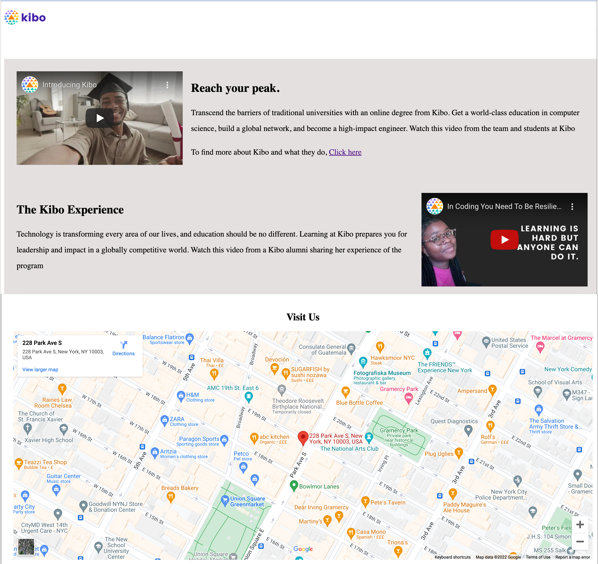

# Kibo mini website

This project is an extract from the [kibo website](https://www.kibo.school). Your task is to embed different multimedia contents in this website and use your knowledge of layout and positioning to arrange the element appropriately.
```
```

## Starter Code
We've provided a starter code which contains the content of the website and the default style. Included files are
  - `index.html`: content of the website which include comments on where you should add your own codes
  - `style.css`: default style for the page.

## Instructions  

  1. Run the code to see the current state of the website.
  2. Add the kibo logo using the provided kibo.png file in the images folder.
  3. Embed this [youtube video](https://www.youtube.com/watch?v=RGjYCLen6os) in the first `<article>` section, such that it is right before "Reach your peak" text.
  4. Use your knowledge of `position` and `display` to place the embedded video and the text side-by-side.
  5. Embed this youtube video in the second `<article>` section just after the "The Kibo Experience" text.
  6. Repeat step 4.
  7. Set the background color of the `<article>` element to `#e5e0e0`.
  8. Embed this address in the `<section>` part as a google map with maximum width. Move the "Visit Us" text to the center of the page.
  9. Finally, your website should look like the one below


  

  10. Submit your work.

### Remember

  1. if you get stuck, read the instructions again.
  2. Remember **G**o **C**limb **K**ibo - first **G**oogle, then ask the **C**ommunity on Discord, then reach out to **K**ibo instructional team.
  3. You can click ‘Submit’ in Replit to view a solution. Don’t forget to try the solution out in your own code, and submit the project again.


  
  
  